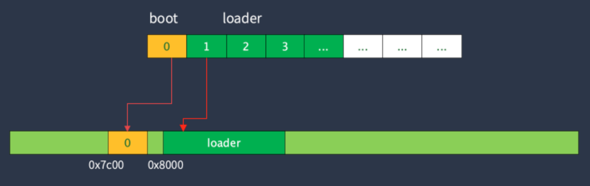

# Basis

## BIOS

BIOS引导程序: 主要用于为操作系统允许初始化环境, 并加载操作系统运行

1. **硬件检测: 包括检测内存容量, 检测硬盘数量等**

> TinyOS的BIOS没有实现硬件检测这一步

2. 进入保护模式: 从16位实模式, 进入到32位保护模式, 实现4GB内存的访问
3. 加载操作系统: 从磁盘加载操作系统文件, 跳到操作系统运行

加载过程: BIOS只加载磁盘的第0个扇区(512字节)到内存中,此部分程序无法做很多事情
TinyOS的做法是:
boot加载到loader(详见loader文件夹里的代码)之后, 由loader负责完成更加复杂的初始化任务

```assembly
// source/boot/start.S
read_loader:
	mov $0x8000, %bx		// 指定loader存放的位置
	mov $0x2, %ah			// AH=02H
	mov $0x2, %cx			// CH=柱面, CL=扇区
	mov $64	, %al			// AL=要读取的扇区数
	mov $0x0080, %dx		// DH=磁头, DL=驱动器 80H~0FFH:硬盘
	int $0x13				// 读取数据存放到指定位置
	// 结果: CF=0:操作成功, AH=00H,AL=传输的扇区数, 否则AH=状态码
	jc read_loader			// 发生错误的时候重试

	jmp boot_entry
	jmp .
```



> 另一种方式是boot加载内核, 内核包含原本由boot需要执行的初始化任务
>
> 关于x86的int13中断: @ref: [操作系统学习7 x86架构使用INT13中读取软盘数据 -- AI头条](https://zhuanlan.zhihu.com/p/682208424)

## x86寄存器

> @ref: [x86寄存器总结 -- Frank__Chen](https://www.cnblogs.com/FrankChen831X/p/10482718.html)

## x86实模式和保护模式

## LB模式读取磁盘

## ELF文件

> 一些图片来自网络, 如有侵权, 请联系删除
