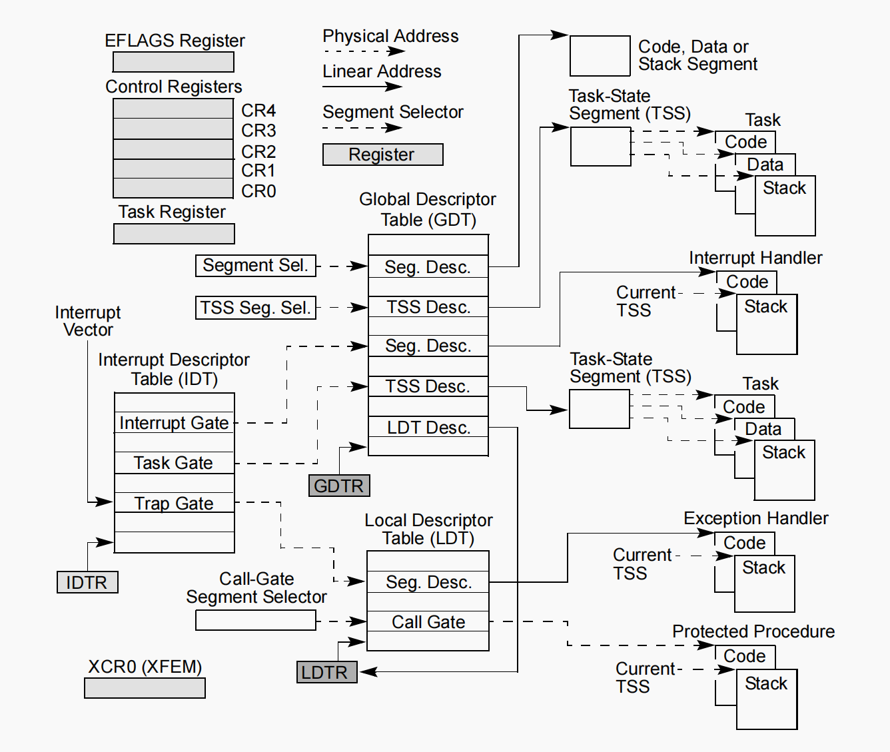

# Basis

## 1. BIOS

BIOS引导程序: 主要用于为操作系统允许初始化环境, 并加载操作系统运行

1. **硬件检测: 包括检测内存容量, 检测硬盘数量等**

> TinyOS的BIOS没有实现硬件检测这一步

2. 进入保护模式: 从16位实模式, 进入到32位保护模式, 实现4GB内存的访问
3. 加载操作系统: 从磁盘加载操作系统文件, 跳到操作系统运行

加载过程: BIOS只加载磁盘的第0个扇区(512字节)到内存中,此部分程序无法做很多事情
TinyOS的做法是:
boot加载到loader(详见loader文件夹里的代码)之后, 由loader负责完成更加复杂的初始化任务

```assembly
// source/boot/start.S
read_loader:
	mov $0x8000, %bx		// 指定loader存放的位置
	mov $0x2, %ah			// AH=02H
	mov $0x2, %cx			// CH=柱面, CL=扇区
	mov $64	, %al			// AL=要读取的扇区数
	mov $0x0080, %dx		// DH=磁头, DL=驱动器 80H~0FFH:硬盘
	int $0x13				// 读取数据存放到指定位置
	// 结果: CF=0:操作成功, AH=00H,AL=传输的扇区数, 否则AH=状态码
	jc read_loader			// 发生错误的时候重试

	jmp boot_entry
	jmp .
```


> 另一种方式是boot加载内核, 内核包含原本由boot需要执行的初始化任务
>
> 关于x86的int13中断: @ref: [操作系统学习7 x86架构使用INT13中读取软盘数据 -- AI头条](https://zhuanlan.zhihu.com/p/682208424)

## 2. x86寄存器

> @ref: [x86寄存器总结 -- Frank__Chen](https://www.cnblogs.com/FrankChen831X/p/10482718.html)

## 3. x86实模式和保护模式

### 3.1 全局描述符表(GDT, Global Descriptor Table)



### 3.2 段选择子(Segment Selector)


| 位范围(Bit) | 字段名称                     | 长度  | 核心作用                                                                                                           |
| ----------- | ---------------------------- | ----- | ------------------------------------------------------------------------------------------------------------------ |
| 0-1         | RPL(Request Privilege Level) | 2 位  | 表示当前请求访问该段的特权级(0-3级, 0级最高, 3级最低), 用于特权级检查                                              |
| 2           | TI(Table Indicator)          | 1 位  | 指示段描述符所在的表: 0=描述符在GDT(全局描述符表)中; 1=描述符在LDT(局部描述符表)中                                 |
| 3-15        | Index(描述符索引)            | 13 位 | 用于计算描述符在 GDT/LDT 中的偏移量: 偏移量 = Index×8(因每个段描述符占 8 字节),可索引 8192 个描述符(2¹³ = 8192) |

```assembly
// source/kernel/cpu/cpu.c
// selector参数是输入的段选择子
void segment_desc_set(int selector, uint32_t base, uint32_t limit,
                      uint16_t attr) {
    // 这里`(selector >> 3)`右移3位即可以获取段选择子的Index, 从而获取其执行的GDT
    segment_desc_t *desc = gdt_table + (selector >> 3);
    ...
```

## 4. LB模式读取磁盘

## 5. ELF文件

> 一些图片来自网络, 如有侵权, 请联系删除
